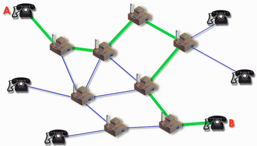
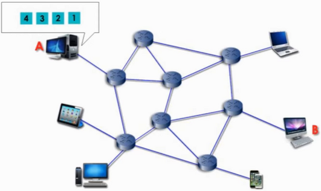
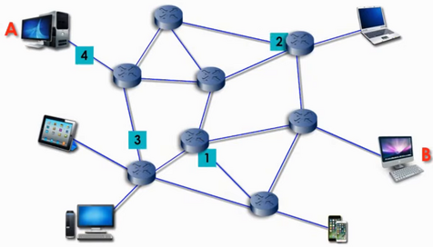
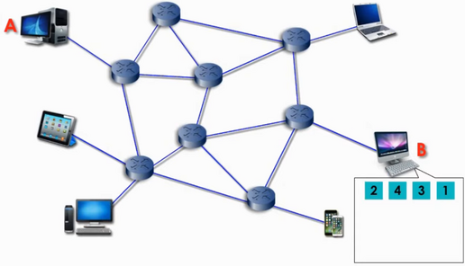

# How the Internet works

Some time ago I read a book called "where wizards stay up late" which is about the origins of the Internet. Ever since, I expect myself to know much more about the Internet, but unfortunately that is not something that I can claim. So I decided to keep a note about all the interesting facts that I learn about the Internet.

## Circuit switching vs packet switching

In my opinion the biggest innovation of the Internet is packet switching. To understand packet switching, first let's look at how the situation was before packet switching (telephone system i.e. circuit switching), and then we'll go through packet switching.

### Circuit switching

To have a phone call with another person, a wire is needed to be routed from one's house to another's. The telephone wire that goes out of one's house go to some intermediate telephone centers which act as a hub for connecting to other telephone centers or direct customers. Here is how it looks like when A wants to have a phone call with B:

In other words, when A has a phone call with B, A is literally connected to B via a wire. In fact A/B are renting the wires of the phone companies, so that they can be connected to the other peer. That's why it's expensive to have a long distance phone call (renting more kms of wire).

### Packet switching

In packet switching, on the other hand, there is no wire connection like circuit switching. In packet switching the data on computer A is broken into packets and then just passed to the router:

The router reads the IP address of the receiver, and decides which router is the best next router for the packet to continue. One packet route might be different than the other's:

At the end the packets arrive at the destination (not necessarily with the order that they were sent), and computer B determines the correct order of the received packets.

All and all, the protocol that fuels the packet switching of the Internet is called TCP/IP.

## The physical mediums of sending and receiving the packets

The question is: what does exactly carry the packets all around the world?

Well, the packets are sent and received through different ways:

1. Fiber cables: 99% percent of all the international communications are communicated though submarine fiber cables! It means that if a person is watching a YouTube video whose file is sitting in a data center in the US, then most probably the packets go through the submarine fiber cables in Atlantic ocean!

2. Satellite: the data from point A can be sent to a satellite, and the satellite can transmit the data to point B. That's it. This method has the disadvantage of big latency (because the signal needs to travel a lot to reach to the satellite and come back to the earth, thus not suitable for many cases). The advantage of satellite is that it's easy to implement.

3. DSL: uses the existing telephone wires, while not blocking the telephone calls. Human voice takes only a small amount of the available bandwidth in the already-existing telephone copper wire. DSL exploits the unused available bandwidth on the wire. The problem is, the farther you are from the central office, the weaker the signal becomes (usually the distance between customer and the office should be less than 10 km!). Even when one has DSL internet at home, usually fiber cables do most of the work for transmitting the data, and only the data comes through DSL when it gets close to one's house.

4. Cable: uses the existing TV coaxial cable, while providing TV channels. Cable can provide higher speeds than DSL. The problem is that when there are too many users, the speed may start to decline. Even when one has cable internet at home, usually fiber cables do most of the work for transmitting the data, and only the data comes through cable when it gets close to one's house.

## Miscellaneous questions

### How did the dial-up modems work?

In the early days of the Internet, there was no dedicated lines for the Internet. All what we had was telephone lines, which was designed to carry human voice.

To overcome this limitation, MODulator/DEModulator (modem) was designed to convert 0s and 1s to analog audio signals on the wire. The reason that the dial-up modems made such horrible sounds, was due to the fact that it was literally sending 0s and 1s in the form of audio signals to the ISP to make the initial negotiation for the maximum possible speed.

But DSL also uses phone lines. How comes that while using dial-up the phone line was unusable, but that's not the case with DSL? Because technology got better and helped DSL to push the Internet signals to a higher frequency, thus the phone line for human voice(20Hz-20000Hz) remains unblocked.

## Open questions to be investigated

* Do we need a modem for fiber connection?
